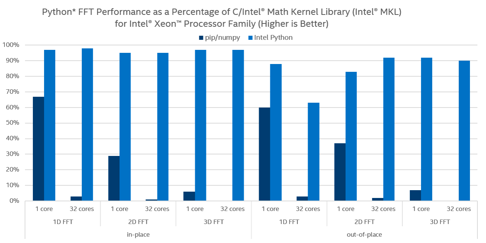

Thin wrapper exposing Intel |R| MKL's FFT functionality directly on NumPy arrays was used to optimize FFT support in both NumPy and SciPy.
It allows FFT-based Python programs to approach performance of equivalent C implementations. 

.. provide charts of Python code performance in terms of percent of native performance [ reuse charts for Haswell from release notes ]

Thanks to Intel |R| MKL's flexibility in its supports for arbitrarily strided input and output arrays [1]_ both one-dimensional and 
multi-dimensional complex Fast Fourier Transforms along distinct axes can be performed directly, without the need to copy the input 
into a contiguous array first. Input strides can be arbitrary, including negative or zero, as long strides remain an integer multiple 
of array's item size.

.. provide charts of computing FFT along axis, FFT of transposed array, FFT of stack of images, etc.

The wrapper supports both in-place and out-of-place modes, enabling it to efficiently power both `numpy.fft` and `scipy.fftpack` submodules. 
In-place operations are only performed where possible.

.. provide charts comparing timings of in-place and out-of-place FFT computations
.. provide charts comparing timings of in-place operations in update 2|3 vs. update 1

Direct support for multivariate transforms along distinct array axis. Even when multivariate transform ends up being computed as iterations 
of one-dimensional transforms, all subsequent iterations are performed in place for efficiency.

The update also provides dedicated support for complex FFTs on real inputs, such as `np.fft.fft(real_array)`, by leveraging corresponding
functionality in MKL [2]_.

.. Illustrate the point that this became faster

Dedicated support for specialized real FFTs, which only store independent complex harmonics. Both `numpy.fft.rfft` and `scipy.fftpack.rfft` 
storage  modes are natively supported via Intel MKL.

.. show rfft is faster in update 2 relative to update 1

References
----------

.. |C| unicode:: 0xA9 .. copyright sign
   :ltrim:
.. |R| unicode:: 0xAE .. registered sign
   :ltrim:
.. |TM| unicode:: 0x2122 .. trade mark sign
   :ltrim:

.. [1] https://software.intel.com/en-us/mkl-developer-reference-c-dfti-input-strides-dfti-output-strides#10859C1F-7C96-4034-8E66-B671CE789AD6
.. [2] https://software.intel.com/en-us/mkl-developer-reference-c-dfti-complex-storage-dfti-real-storage-dfti-conjugate-even-storage#CONJUGATE_EVEN_STORAGE
.. [fft_bench] http://github.com/intelpython/fft_benchmark
